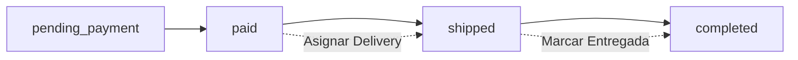

# Sistema de Deliveries - Documentación Técnica

## Resumen Ejecutivo

El sistema de deliveries permite asignar **repartidores** a órdenes para gestionar el proceso de entrega de productos. Este sistema es **esencial** para el flujo completo de administración de pedidos.

---

## ¿Por qué necesitamos la columna `delivery_id`?

### Problema Actual
El error que estás experimentando:
```
SQLSTATE[42S22]: Column not found: 1054 Unknown column 'orders.delivery_id'
```

Ocurre porque **la migración existe pero no ha sido ejecutada**. La columna `delivery_id` es necesaria para conectar las órdenes con los repartidores.

### Solución del Negocio
Sin esta columna, **NO es posible**:
1. Asignar un repartidor a una orden
2. Ver qué órdenes tiene asignadas cada delivery
3. Rastrear cuándo se asignó una orden
4. Marcar cuándo se entregó una orden
5. Calcular estadísticas de deliveries (órdenes activas, total de entregas, etc.)

---

## Arquitectura del Sistema

### Relaciones de Base de Datos

```
┌─────────────────┐           ┌─────────────────┐
│     users       │           │     orders      │
├─────────────────┤           ├─────────────────┤
│ id (PK)         │◄──────────┤ delivery_id (FK)│
│ name            │  1     N  │ user_id (FK)    │
│ email           │           │ assigned_at     │
│ ...             │           │ delivered_at    │
└─────────────────┘           │ status          │
                              │ ...             │
                              └─────────────────┘

Relación: Un delivery (usuario con rol 'delivery') puede tener
          muchas órdenes asignadas.
```

### Estados de una Orden con Delivery



---

## Migración: `2025_08_13_000001_add_delivery_id_to_orders_table.php`

### Ubicación
```
database/migrations/2025_08_13_000001_add_delivery_id_to_orders_table.php
```

### Qué hace
Agrega **3 columnas** a la tabla `orders`:

1. **`delivery_id`** (foreignId nullable)
   - Referencia a la tabla `users` (el repartidor asignado)
   - Es nullable porque no todas las órdenes tienen delivery asignado
   - Se elimina automáticamente si se borra el usuario (nullOnDelete)

2. **`assigned_at`** (timestamp nullable)
   - Registra cuándo se asignó el delivery a la orden
   - Útil para métricas de tiempo de respuesta

3. **`delivered_at`** (timestamp nullable)
   - Registra cuándo se completó la entrega
   - Útil para calcular tiempo de entrega

### Código de la Migración
```php
Schema::table('orders', function (Blueprint $table) {
    $table->foreignId('delivery_id')
        ->nullable()
        ->after('user_id')
        ->constrained('users')
        ->nullOnDelete();

    $table->timestamp('assigned_at')->nullable()->after('delivery_id');
    $table->timestamp('delivered_at')->nullable()->after('assigned_at');
});
```

---

## Dependencias del Sistema

### 1. Modelo `Order` (app/Models/Order.php)

**Relación con Delivery:**
```php
public function delivery()
{
    return $this->belongsTo(User::class, 'delivery_id');
}
```

**Métodos que usan `delivery_id`:**
```php
// Asignar delivery a la orden
public function assignDelivery($deliveryId)
{
    $this->update([
        'delivery_id' => $deliveryId,
        'assigned_at' => now(),
    ]);
}

// Marcar como entregada
public function markAsDelivered()
{
    $this->update([
        'status' => 'completed',
        'delivered_at' => now(),
    ]);
}
```

---

### 2. Modelo `User` (app/Models/User.php)

**Relación inversa (Deliveries):**
```php
// Un delivery puede tener muchas órdenes asignadas
public function assignedOrders()
{
    return $this->hasMany(Order::class, 'delivery_id');
}
```

Esta relación es **crítica** para:
- Listar todas las órdenes de un delivery
- Contar órdenes activas
- Calcular total de entregas

---

### 3. Controlador Web `Admin\DeliveryController` (líneas 19-28)

**AQUÍ ES DONDE OCURRE EL ERROR:**

```php
$deliveries = User::role('delivery')
    ->select('id', 'name', 'email', 'tel', 'created_at')
    ->withCount(['assignedOrders as active_orders' => function ($query) {
        $query->whereIn('status', ['paid', 'shipped']);
    }])
    ->withCount('assignedOrders as total_deliveries')
    ->get();
```

Este código intenta:
1. Obtener todos los usuarios con rol 'delivery'
2. Contar sus **órdenes activas** (usa `assignedOrders` → depende de `delivery_id`)
3. Contar **total de entregas** (usa `assignedOrders` → depende de `delivery_id`)

**Sin la columna `delivery_id`, esta consulta falla.**

---

### 4. Controlador API `API\Admin\DeliveryController`

**Endpoints que dependen de `delivery_id`:**

1. **`GET /api/admin/deliveries`** (líneas 19-28)
   - Lista deliveries con conteo de órdenes
   - Requiere: `delivery_id` en orders

2. **`POST /api/admin/deliveries/{orderId}/assign`** (líneas 99-140)
   - Asigna delivery a una orden
   - Requiere: `delivery_id` en orders

3. **`DELETE /api/admin/deliveries/{orderId}/unassign`** (líneas 149-173)
   - Desasigna delivery de una orden
   - Requiere: `delivery_id` en orders

4. **`GET /api/admin/deliveries/{deliveryId}/orders`** (líneas 182-210)
   - Obtiene órdenes de un delivery
   - Requiere: `delivery_id` en orders

5. **`DELETE /api/admin/deliveries/{id}`** (líneas 218-266)
   - Elimina delivery (verifica órdenes activas)
   - Requiere: `delivery_id` en orders

---

### 5. Página Vue `Deliveries.vue`

**Funcionalidades que requieren la columna:**
- **Estadísticas**: Total de órdenes activas y completadas por delivery
- **Tabla**: Mostrar conteo de órdenes por delivery
- **Botón "Ver Órdenes"**: Navegar a órdenes de un delivery
- **Validación de eliminación**: No permitir borrar delivery con órdenes activas

---

## Flujo Completo del Sistema

### 1. Crear Delivery
```
Admin → Crea usuario con rol 'delivery'
      → Usuario puede ver órdenes asignadas
```

### 2. Asignar Delivery a Orden
```
Orden (status: paid)
  ↓
Admin asigna delivery
  ↓
Se actualiza:
  - orders.delivery_id = [id del delivery]
  - orders.assigned_at = [timestamp actual]
  - orders.status = 'shipped'
```

### 3. Marcar como Entregada
```
Orden (status: shipped)
  ↓
Delivery/Admin marca como entregada
  ↓
Se actualiza:
  - orders.delivered_at = [timestamp actual]
  - orders.status = 'completed'
```

---

## 📋 SOLUCIÓN: Cómo Ejecutar la Migración

### Paso 1: Verificar que la migración existe
```bash
ls database/migrations/*add_delivery_id_to_orders*
```

**Resultado esperado:**
```
database/migrations/2025_08_13_000001_add_delivery_id_to_orders_table.php
```

✅ **La migración YA EXISTE**

---

### Paso 2: Ejecutar las migraciones pendientes

**En Windows (Laragon):**
```bash
php artisan migrate
```

**Salida esperada:**
```
Running migrations.
2025_08_13_000001_add_delivery_id_to_orders_table .............. RUNNING
2025_08_13_000001_add_delivery_id_to_orders_table .............. DONE
```

---

### Paso 3: Verificar que la columna se creó

```bash
php artisan tinker
```

Luego ejecuta:
```php
use Illuminate\Support\Facades\Schema;
Schema::hasColumn('orders', 'delivery_id');  // Debe retornar: true
Schema::hasColumn('orders', 'assigned_at');  // Debe retornar: true
Schema::hasColumn('orders', 'delivered_at'); // Debe retornar: true
exit
```

---

### Paso 4: (Opcional) Ejecutar Seeders para Datos de Prueba

```bash
php artisan db:seed --class=TestDataSeeder
```

Esto creará:
- 1 usuario cliente (cliente@test.com / password)
- 1 usuario delivery (delivery@test.com / password)
- 10 órdenes de prueba
- Direcciones y productos asociados

---

## Verificación Post-Migración

### 1. Acceder a la página de Deliveries
```
http://127.0.0.1:8000/admin/deliveries
```

**Antes de migrar:** Error SQL
**Después de migrar:** Página carga correctamente

---

### 2. Verificar Estadísticas
La página debe mostrar:
- Total Deliveries: [cantidad]
- Órdenes Activas: [cantidad]
- Total Entregas: [cantidad]

---

### 3. Crear un Delivery de Prueba
1. Click en "Crear Delivery"
2. Completar formulario
3. Verificar que aparece en la tabla

---

## Endpoints API Disponibles

Una vez ejecutada la migración, estos endpoints estarán disponibles:

```
POST   /api/admin/deliveries                    → Crear delivery
GET    /api/admin/deliveries                    → Listar deliveries
POST   /api/admin/deliveries/{orderId}/assign   → Asignar a orden
DELETE /api/admin/deliveries/{orderId}/unassign → Desasignar de orden
GET    /api/admin/deliveries/{id}/orders        → Ver órdenes de delivery
DELETE /api/admin/deliveries/{id}               → Eliminar delivery
```

**Autenticación:** Requieren Bearer Token de admin

---

## Estructura de Datos

### Tabla `orders` (después de migración)

| Campo         | Tipo      | Descripción                     |
|---------------|-----------|---------------------------------|
| id            | bigint    | Primary key                     |
| user_id       | bigint    | Cliente que realizó la orden    |
| **delivery_id**   | **bigint**    | **Repartidor asignado (nullable)** |
| address_id    | bigint    | Dirección de envío              |
| **assigned_at**   | **timestamp** | **Cuándo se asignó (nullable)**    |
| **delivered_at**  | **timestamp** | **Cuándo se entregó (nullable)**   |
| status        | string    | Estado actual                   |
| ...           | ...       | Otros campos                    |

---

## Troubleshooting

### Error: "Column not found: delivery_id"
**Causa:** La migración no se ha ejecutado
**Solución:** Ejecutar `php artisan migrate`

### Error al crear delivery: "Role [delivery] does not exist"
**Causa:** Los roles no se han creado
**Solución:** Ejecutar `php artisan db:seed --class=RolesAndPermissionsSeeder`

### No aparecen órdenes en un delivery
**Causa:** No hay órdenes asignadas
**Solución:**
1. Ir a "Gestión de Órdenes"
2. Seleccionar una orden
3. Asignar delivery desde el detalle de la orden

---

## Resumen

1. ✅ **La migración existe** en: `database/migrations/2025_08_13_000001_add_delivery_id_to_orders_table.php`
2. ✅ **Es absolutamente necesaria** para el sistema de deliveries
3. ✅ **Múltiples archivos dependen de ella**:
   - Order.php (modelo)
   - User.php (modelo)
   - DeliveryController.php (web)
   - DeliveryController.php (API)
   - Deliveries.vue (frontend)
4. ⚠️ **Acción requerida**: Ejecutar `php artisan migrate`

---

## Próximos Pasos

Después de ejecutar la migración:

1. ✅ Crear deliveries desde el panel admin
2. ✅ Asignar órdenes a deliveries
3. ✅ Ver estadísticas de entregas
4. 🚧 Implementar chat admin-cliente (backend listo, frontend pendiente)
5. 🚧 Agregar notificaciones por email/SMS al asignar delivery
6. 🚧 Panel para que deliveries vean sus órdenes asignadas

---

**Fecha de creación:** 2025-08-13
**Última actualización:** 2025-08-13
**Estado:** ✅ Migración lista para ejecutar
